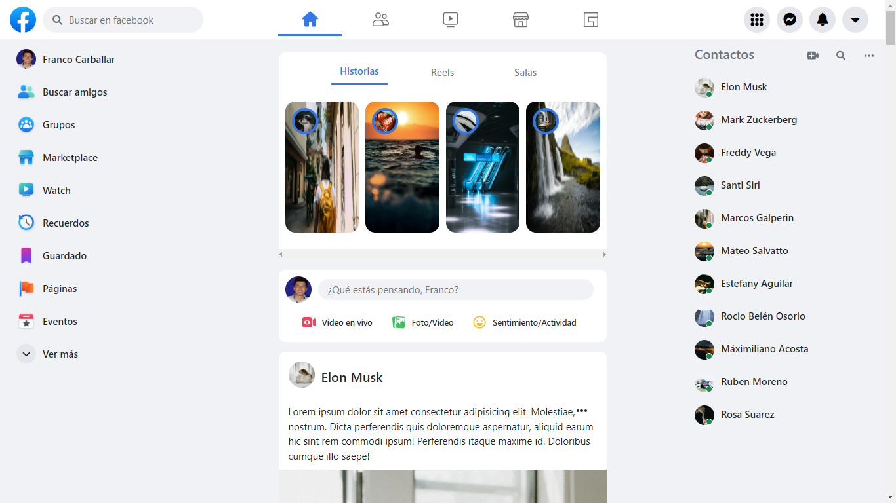
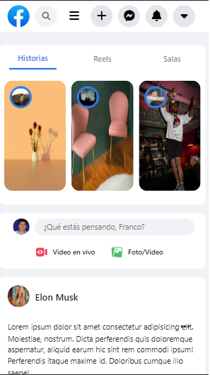

# Clon de Facebook

Clon del feed de Facebook, es una proyecto creado para prácticar los conceptos del desarrollo web. Su única intención es imitar la apariencia y el funcionamiento de www.facebook.com, no tiene como objetivo reemplazar o sustituir la página oficial de Facebook.

## Ver está página:

https://clon-facebook.vercel.app/

## Tecnologías utilizadas:

- HTML
- CSS
- Responsive Design (Siguiendo la metodología de Mobile First)
- JavaScript
- React
- Bootstrap

## También utilicé:

- React Bootstrap ([Ver más](https://react-bootstrap.github.io/))
- FontAwesome ([Ver más](https://fontawesome.com))

## Funcionamiento:

La apariencia del sitio es muy parecida a la del sito web original (por no decir igual). Tiene un diseño web que se adapta al dispositivo que se está empleando para visitar la página. Tiene el modo oscuro agregado, con la capacidad de guardar las preferencias en el navegador.

## Habilidades adquiridas:

Aprendí a utilizar Bootstrap en un proyecto real y complejo, practiqué el pensamiento enfocado en componentes (todo es un componente de UI).

## Imágenes:

- Desktop:

- Mobile:

### Creado por @francocarballar
